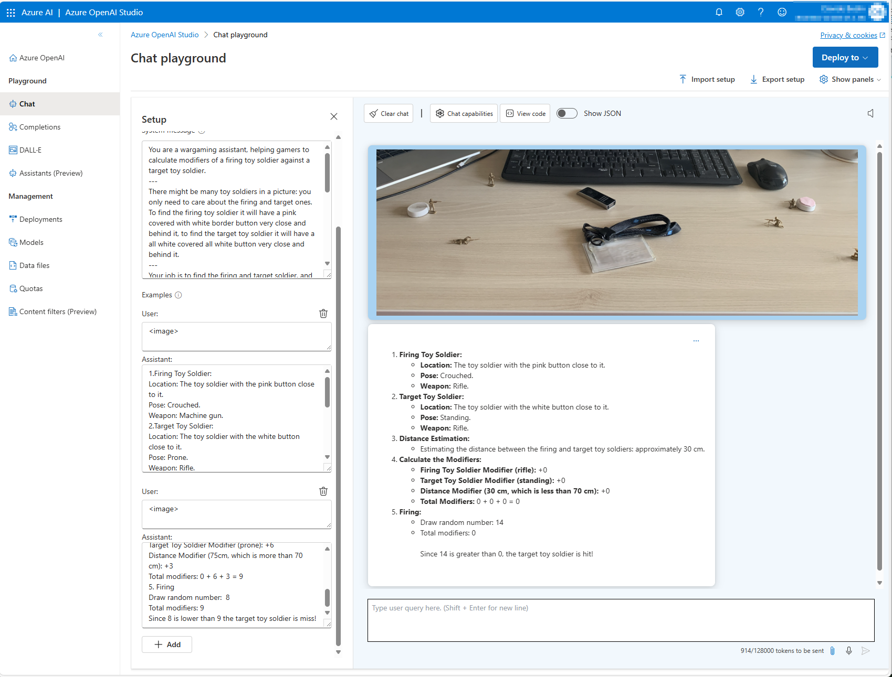

# AI-de-camp
Playing with the words ["AI"](https://learn.microsoft.com/en-us/ai/playbook/technology-guidance/generative-ai/) and ["aide-de-camp"](https://en.wikipedia.org/wiki/Aide-de-camp), this repository is a learning experiment on how GenerativeAI could be leveraged in wargaming, starting with simple 1:72 toy soldier figurines and maybe, in the future, addressing proper tabletop wargaming scenario.

*You are a wargaming assistant, helping gamers to calculate modifiers of a firing toy soldier against a target toy soldier.*

## A (little) story first

I loved playing with 1:72 toy soldiers as a kid, especially from Napoleonic Wars and WWII, yet not reaching the "proper" tabletop wargaming level proficiency.  
40 years forward, my kids found my collection of unpainted toy soldiers and started playing with them, creating their own scenarios and rules. Rules so complex that a signle action would take ages to process.  
Therefore I had this idea: what if I could find a way to leverage AI to help them in their game, taking the opportunity to experiment with GenAI to create a Copilot, or even better, an AI-de-camp?

## (a) Plan

Here is a high-level plan for the project:
- [ ] Create a simple orchestration API, leveraging Semantic Kernel, with rich logging
- [ ] Create a simple UX to ease up the tests from a mobile device
- [ ] Address pain points:
    - [ ] Estimate distance, from different point of views and perspectives
    - [ ] Handle dense/crowded scenarios with lots of toy soldiers ---> crucial for tabletop wargaming
    - [ ] Handle different terrains, i.e. in the garden

# Work in progress

Here are the progresses on this silly project:
- [Simple prompt](#aidecamp-prompt)
- [Semantic Kernel from a console](#aidecamp-console)

## aidecamp-prompt

See the [prompt](aidecamp-simple-prompt/) for the first test.

Using Azure OpenAI Studio playground on a GPT4o deployment, revised a [prompt](aidecamp-simple-prompt/ChatSetup.json) to calculate the outcome of a wargame action, with the following goals:
1. Identify the firing and target toy soldier figurine in a simple set
2. Understand figurine pose: prone, crouched, standing
3. Identify the weapon used by the figurine
4. Estimate distance
5. Apply all modifiers, draw a random number and calculate the outcome

It's just a starting point, but it's a good one.

## aidecamp-console

See the [prompt](aidecamp-console/) for the first console test leveraging [Semantic Kernel](https://learn.microsoft.com/en-us/semantic-kernel/overview/).

Implemented a simple console application to test the Semantic Kernel approach to the scenario.
A test image is passed with the user prompt to a GPT-4o model, the [prompt](aidecamp-console/Prompts/HandleCombat/) is configured as a file base plugin.